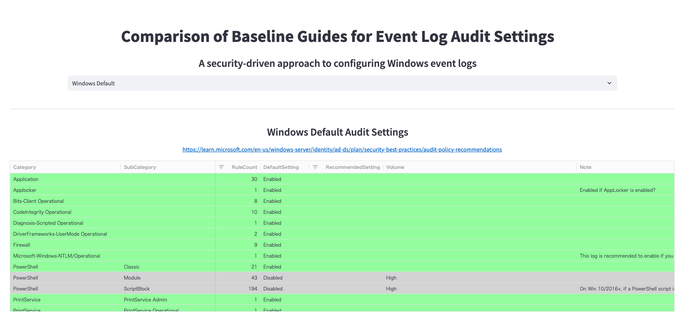
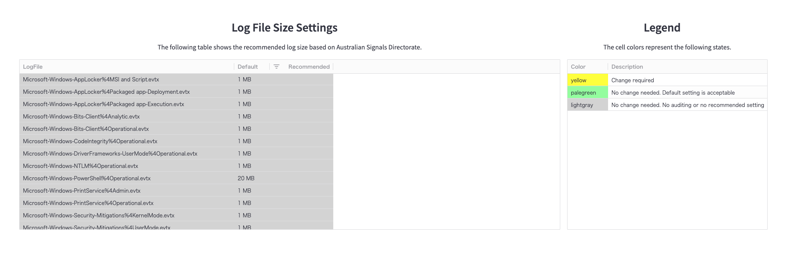
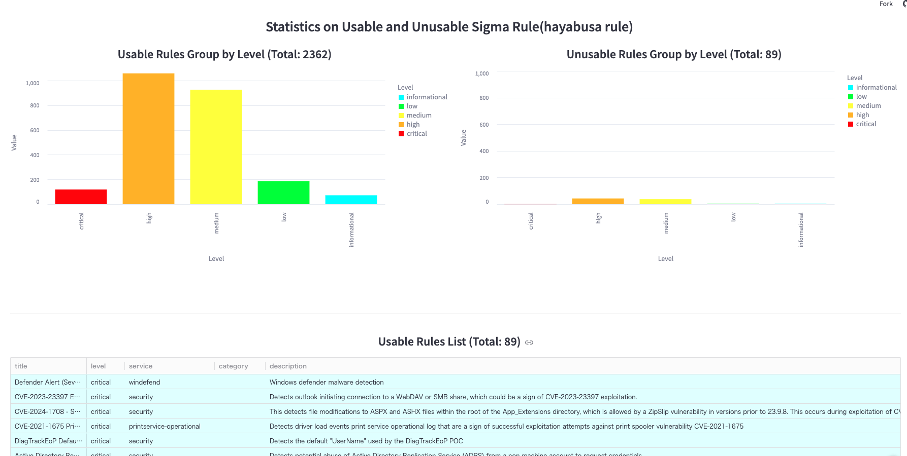
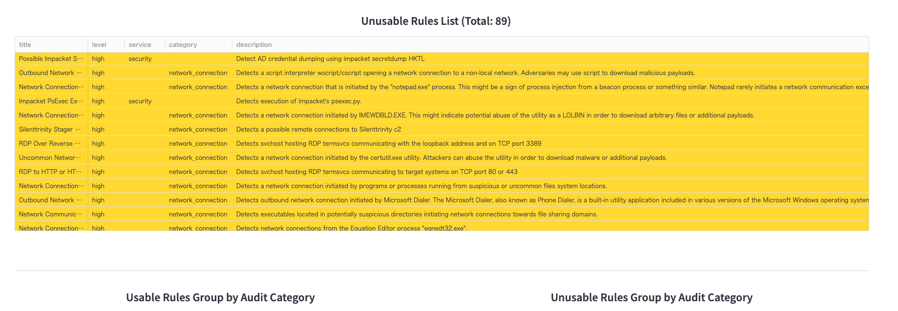
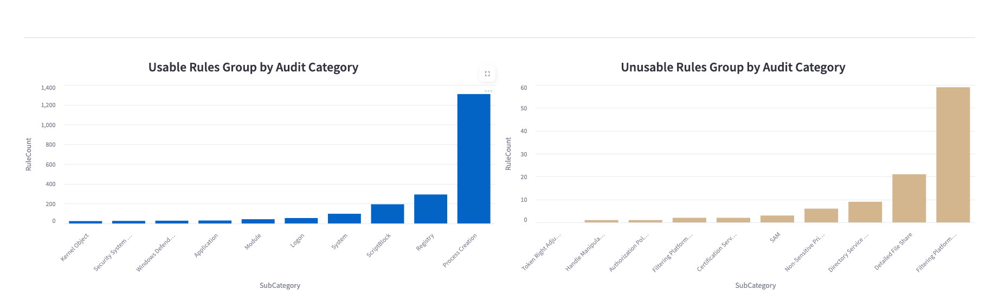

# Event Log Baseline Guide Comparison Tool
A comprehensive Streamlit application for comparing and analyzing Windows Event Log audit settings across different security baseline guides.

## Live Demo
[https://yamato-security-eventlog-baseline-guide-streamlit-app-gwlyjo.streamlit.app/](https://yamato-security-eventlog-baseline-guide-streamlit-app-gwlyjo.streamlit.app/)

## Features

### Baseline Guide Comparison
Compare audit settings across multiple authoritative sources:
- **Windows Default**: Microsoft's default configuration
- **YamatoSecurity**: Community-driven security configurations
- **Australian Signals Directorate**: Government security recommendations
- **Microsoft Server**: Server-specific recommendations
- **Microsoft Client**: Client-specific recommendations

## Screenshot










### Key Metrics
- **Audit Settings Analysis**: Detailed breakdown of recommended vs default settings
- **Log File Size Recommendations**: Optimal log retention settings
- **Sigma Rule Statistics**: Impact analysis on detection rule effectiveness
- **Service and Category Breakdown**: Granular analysis by Windows services and categories

## Color-Coded Interface

The application uses an intuitive color-coding system:
- **🟡 Yellow**: Changes required from default settings
- **🟢 Pale Green**: Default settings are acceptable
- **⚪ Light Gray**: No auditing required or no recommendations available

## Usage

1. **Select a Baseline Guide**: Use the dropdown menu to choose your preferred baseline
2. **Review Audit Settings**: Examine the color-coded recommendations table
3. **Analyze Log Settings**: Check file size recommendations
4. **Evaluate Rule Impact**: Review Sigma rule effectiveness statistics
5. **Compare Results**: Switch between different guides to compare approaches

## Key Insights

The tool helps answer critical questions:
- Which audit settings need to be changed from defaults?
- How do different baseline guides compare?
- What's the impact on detection rule effectiveness?
- Which Windows services are most affected by configuration changes?

## How to use(locally)
```
git clone https://github.com/Yamato-Security/EventLog-Baseline-Guide.git
cd EventLog-Baseline-Guide
pip install -r requirements.txt
streamlit run streamlit_app.py 

## Reference Links

Each baseline guide includes direct links to official documentation:
- Microsoft documentation for official recommendations
- YamatoSecurity GitHub repository for community guidelines
- Australian Signals Directorate official resources

## Notes
- The application provides real-time analysis of audit configuration impact
- Color coding helps quickly identify required changes
- Interactive charts allow for detailed exploration of data
- All recommendations are based on established security best practices

## Contributing

We would love any form of contribution. Pull requests, rule creation and sample evtx logs are the best but feature requests, notifying us of bugs, etc... are also very welcome.
At the least, if you like our tool then please give us a star on GitHub and show your support!

## License
This project is licensed under the MIT License. See the [LICENSE](LICENSE) file for details.

*This tool is designed to help security professionals make informed decisions about Windows event log configuration based on established security baselines and their impact on detection rule effectiveness.*